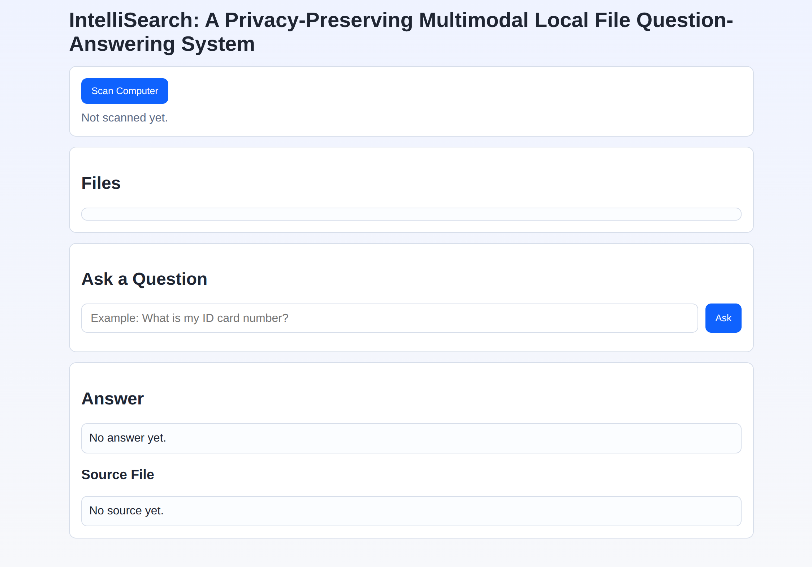
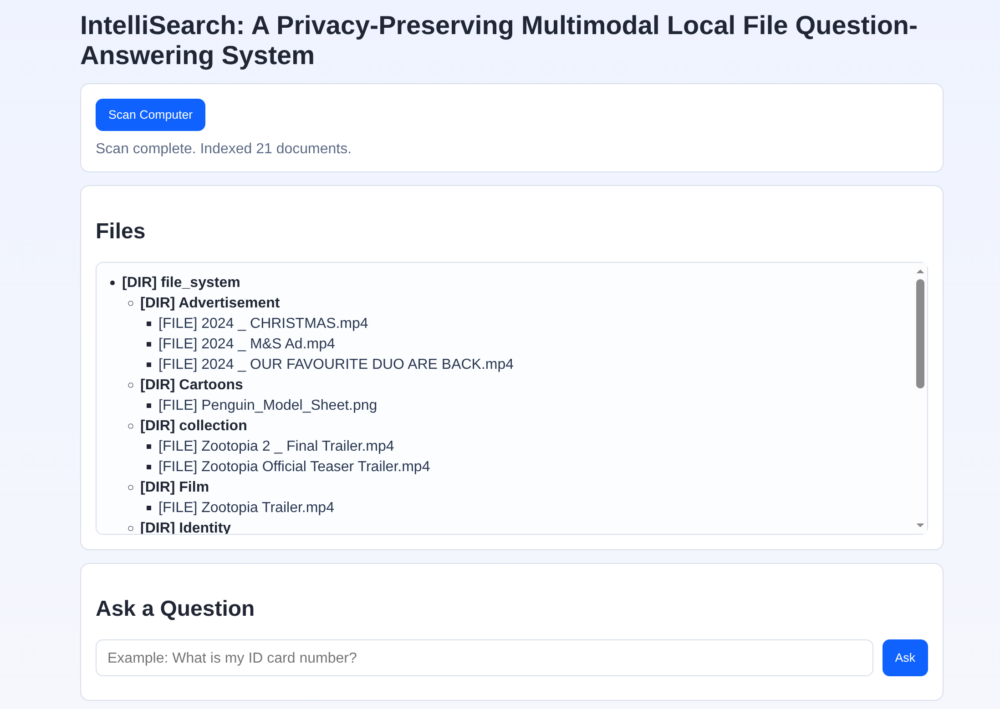
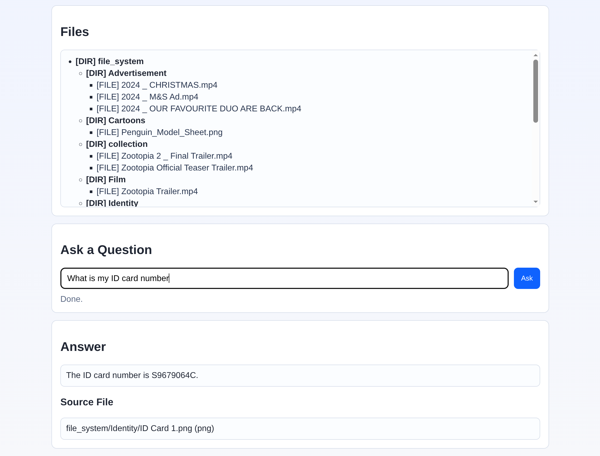

# Local File QA POC

This project is a proof-of-concept web app for asking questions about local files.

For the POC, the app scans only the `file_system` folder, but the UI presents this as a computer scan.
The system reads only `.json` files to get file content, while showing only original files in the tree view.







## Architecture

- Backend: FastAPI (Python)
- Retrieval: BM25 (`rank-bm25`)
- LLM: Gemini 2.5 Flash Lite (`google-genai`)
- Frontend: plain HTML, CSS, JavaScript

## Project Structure

- `backend/app.py`: API server and static frontend hosting
- `backend/scanner.py`: folder scanning and JSON content extraction
- `backend/indexer.py`: BM25 indexing and retrieval
- `backend/qa_service.py`: Gemini answer generation
- `frontend/index.html`: UI
- `frontend/script.js`: scan/search interactions
- `frontend/style.css`: basic styles
- `file_system/`: sample files and JSON companions

## Prerequisites

- Python 3.10+
- A Gemini API key

## 1) Create a Python Environment

From the project root:

```bash
python3 -m venv .venv
source .venv/bin/activate
python -m pip install --upgrade pip
python -m pip install -r backend/requirements.txt
```

If your friend is on Windows (PowerShell):

```powershell
python -m venv .venv
.\.venv\Scripts\Activate.ps1
python -m pip install --upgrade pip
python -m pip install -r backend/requirements.txt
```

## 2) Configure Gemini API Key

Create or update `.env` in project root:

```bash
echo "GEMINI_API_KEY=your_api_key_here" >> .env
```

If `.env` already exists, just ensure `GEMINI_API_KEY` is set correctly.

How to get an API key:

1. Go to Google AI Studio.
2. Create/sign in to your Google account.
3. Generate an API key.
4. Put it in `.env` as `GEMINI_API_KEY=...`.

## 3) Run Backend (Also Serves Frontend)

From project root:

```bash
python -m uvicorn backend.app:app --reload --app-dir .
```

Open in browser:

- `http://127.0.0.1:8000`

## 4) Use the App

1. Click **Scan Computer**.
2. Verify tree view shows folders/files from `file_system` and does not show `.json` files.
3. Ask a question in the search bar.
4. Check answer text and source file display.

## 5) Suggested Test Queries

- `What is my ID card number?`
- `What happened on graduation day?`
- `What is in the Christmas advertisement?`

Expected behavior:

- BM25 selects the top 3 most relevant JSON-backed files.
- Gemini answers based on that content.
- UI shows which file the answer came from.

## API Endpoints

- `GET /api/scan`
  - Builds or reuses cached index and returns file tree + indexed document count.
- `POST /api/search`
  - Request body:

    ```json
    { "query": "What is my ID card number?" }
    ```

  - Response includes:
    - `answer`
    - `source.file_path`
    - `source.file_name`
    - `source.file_type`
    - `matched_preview`

## Notes for Your Frontend Friend

- Current UI is intentionally minimal and functional only.
- You can replace styling and layout without changing API contracts.
- Keep `/api/scan` and `/api/search` request/response formats for compatibility.

## Troubleshooting

- Error: `GEMINI_API_KEY is missing`
  - Ensure `.env` exists in project root and key name is exact.
- Empty or irrelevant answer
  - Try a more specific query.
  - Confirm target content exists in related JSON under `file_system`.
- Dependency issues
  - Activate the virtual environment, then re-run `python -m pip install -r backend/requirements.txt`.
